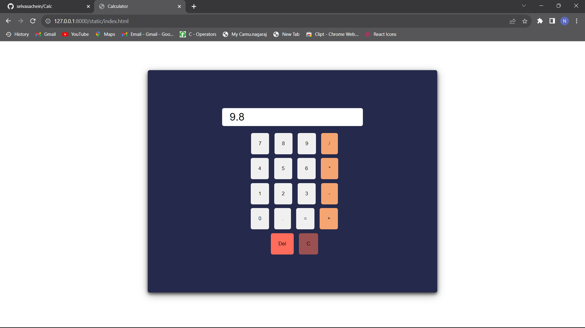
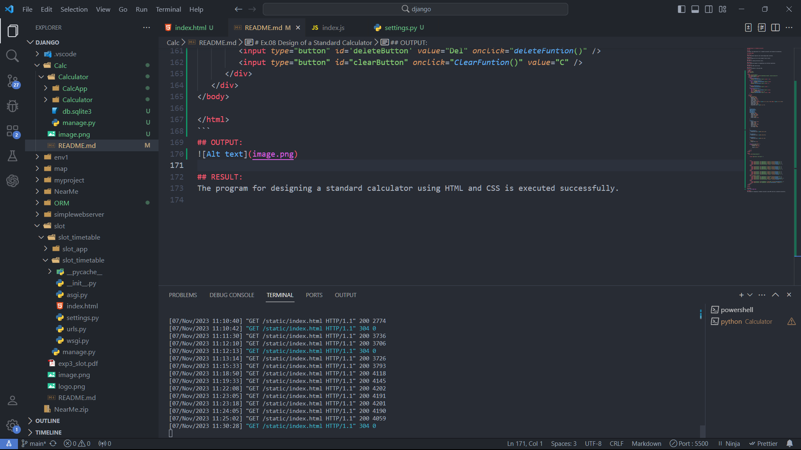

# Ex.08 Design of a Standard Calculator
## Date:

## AIM:
To design a web application for a standard calculator with minimum five operations.

## DESIGN STEPS:

### Step 1:
Clone the github repository and create Django admin interface.

### Step 2:
Change settings.py file to allow request from all hosts.

### Step 3:
Use CSS for creating attractive colors.

### Step 4:
Write JavaScript program for implementing five different operations.

### Step 5:
Validate the HTML and CSS code.

### Step 6:
Publish the website in the given URL.

## PROGRAM :
```html
<!DOCTYPE html>
<html lang="en">

<head>
   <meta charset="UTF-8">
   <meta name="viewport" content="width=device-width, initial-scale=1.0">
   <title>Calculator</title>
   <script>
      function display(val) {
         document.getElementById('result').value += val;
      }
      function SolveCalculation() {
         var x = document.getElementById('result').value;
         var y = eval(x);
         document.getElementById('result').value = y;

      }
      function ClearFuntion() {
         document.getElementById('result').value = ''
      }
      function deleteFuntion() {
         var temp = ''
         temp = document.getElementById('result').value;
         var len = temp.length;
         temp = temp.substring(0, len - 1)
         document.getElementById('result').value = temp;
      }

   </script>
   <style>
      .App-container {
         padding: 100px;
         margin-top: 5%;
         line-height: 55px;
         border: none;
         border-radius: 5px;
         box-shadow: 0 4px 8px 0 rgba(0, 0, 0, 0.6), 0 6px 20px 0 rgba(0, 0, 0, 0.39);
         margin-left: 25%;
         margin-right: 25%;
         text-align: center;
         background-color: rgb(37, 41, 75);


      }

      #numberButton,
      #operatorButton,
      #EqualButton,
      #clearButton,
      #deleteButton {
         padding: 20px;
         margin-top: 10px;
         margin-left: 10px;
         cursor: pointer;
         border: none;
         border-radius: 5px;

      }

      #result {
         border-radius: 5px;
         height: 45px;
         border: none;
         padding-left: 20px;
         color: black;
         font-size: 28px;
         font-weight: 500;


      }

      #operatorButton {
         background-color: rgb(245, 165, 114);
      }

      #deleteButton {
         background-color: rgb(255, 108, 92);
      }

      #clearButton {
         background-color: rgb(155, 81, 81);
      }

      .lastdiv {
         margin-left: 3px;
      }

      @media(max-width:576px) {
         .App-container {
            padding: 20px 0px;

            margin: 50% 6%;

         }
      }
   </style>
</head>

<body>
   <div class="App-container">


      <input type="text" id="result" />


      <div>
         <input type="button" id="numberButton" value="7" onclick="display('7')" />
         <input type="button" id="numberButton" value="8" onclick="display('8')" />
         <input type="button" id="numberButton" value="9" onclick="display('9')" />
         <input type="button" id="operatorButton" value="/" onclick="display('/')" />
      </div>
      <div>
         <input type="button" id="numberButton" value="4" onclick="display('4')" />
         <input type="button" id="numberButton" value="5" onclick="display('5')" />
         <input type="button" id="numberButton" value="6" onclick="display('6')" />
         <input type="button" id="operatorButton" value="*" onclick="display('*')" />
      </div>
      <div>
         <input type="button" id="numberButton" value="1" onclick="display('1')" />
         <input type="button" id="numberButton" value="2" onclick="display('2')" />
         <input type="button" id="numberButton" value="3" onclick="display('3')" />
         <input type="button" id="operatorButton" value="-" onclick="display('-')" />
      </div>
      <div className='lastdiv'>
         <input type="button" id="numberButton" value="0" onclick="display('0')" />
         <input type="button" id="numberButton" value="." onclick="display('.')" />
         <input type="button" id="EqualButton" value="=" onclick="SolveCalculation()" />
         <input type="button" id="operatorButton" value="+" onclick="display('+')" />
      </div>
      <div>
         <input type="button" id='deleteButton' value="Del" onclick="deleteFuntion()" />
         <input type="button" id="clearButton" onclick="ClearFuntion()" value="C" />
      </div>
   </div>
</body>

</html>
```
## OUTPUT:


## RESULT:
The program for designing a standard calculator using HTML and CSS is executed successfully.
